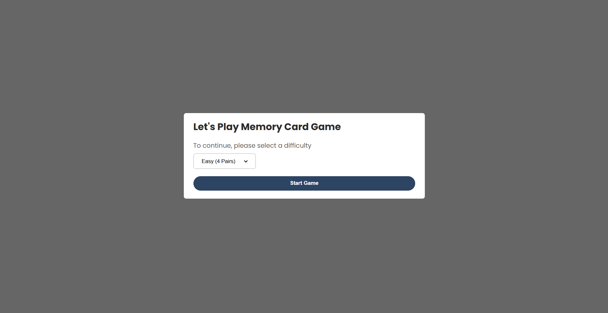
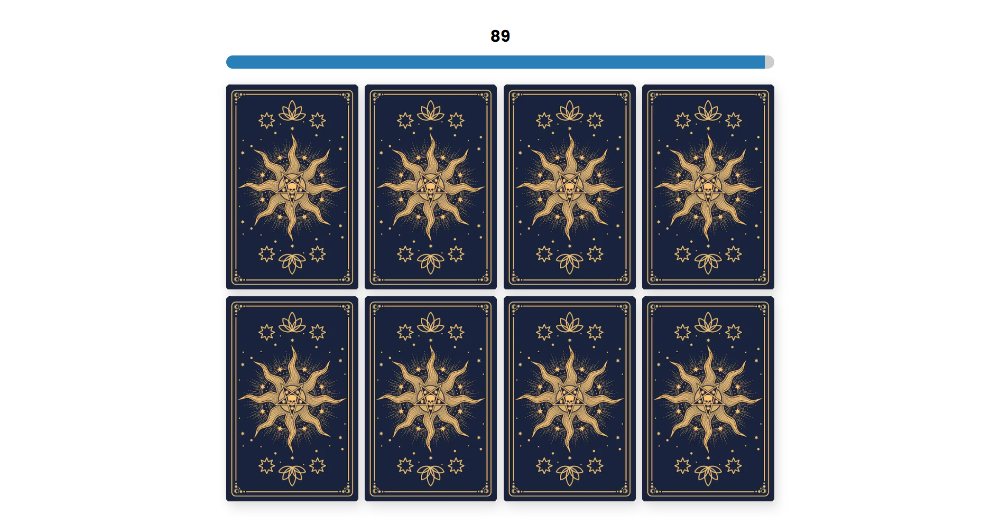
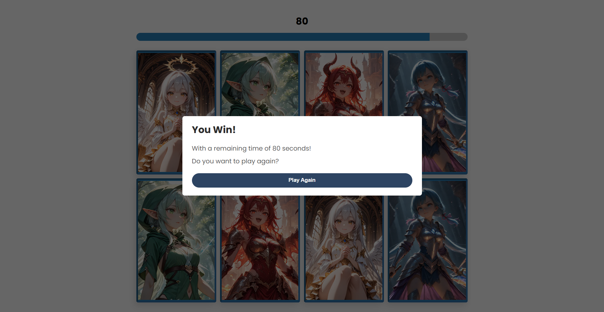

# Memory Card Game
This project is for self learning purpose. 

I tried the ImageDecoder API decode() method, while also playing with the DOM methods to ensure that the card image isn't visible in the DOM until it is flipped.

Since I normally use functional components in React. I'm also experimenting with classes in Javascript for the components like dialog, timer, and select box.

Here are previews of the result:

